# OpenClaw搭建流程-接入消息渠道飞书

**注：不推荐windows，不稳定，有bug**

### openclaw中文官网

[安装 - OpenClaw-连接](https://docs.openclaw.ai/zh-CN/install)

1、shell下载安装

```
curl -fsSL https://openclaw.ai/install.sh | bash
```

2、新手建议通过新手引导配置

```
运行新手引导：openclaw onboard --install-daemon
```

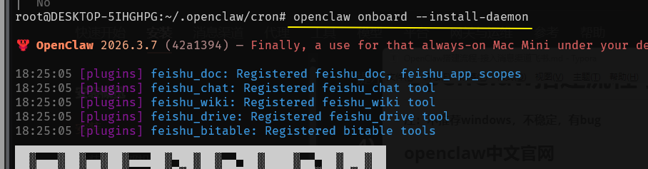

3、选择QuickStart

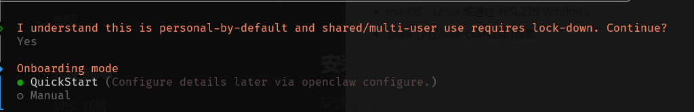

- **Node >=22**
- macOS、Linux 或通过 WSL2 的 Windows
- `pnpm` 仅在从源代码构建时需要

4、Use existing values（选择已存在配置属性）

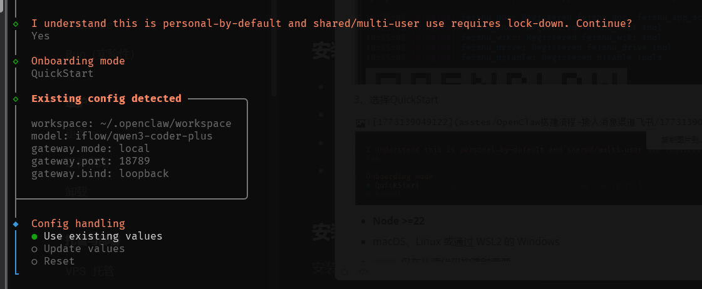

5、模型接入，这里就看自己的模型选择，基本都是一样，后续配置baseUrl和apiKey就行了

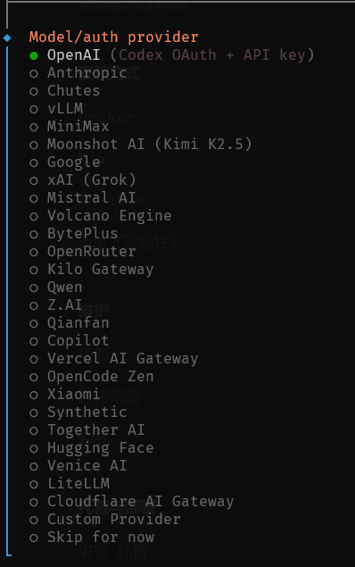

6、OpenAI API Key

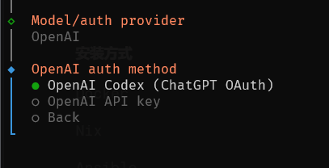

7、Paste API key now（粘贴apiKey）

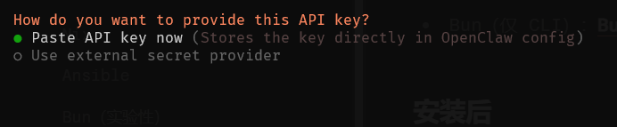

8、模型选择

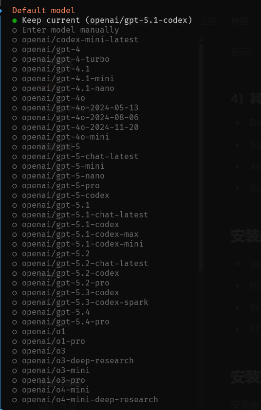

9、选择消息接入，实现远程给openclaw发消息，执行操作；我选择飞书

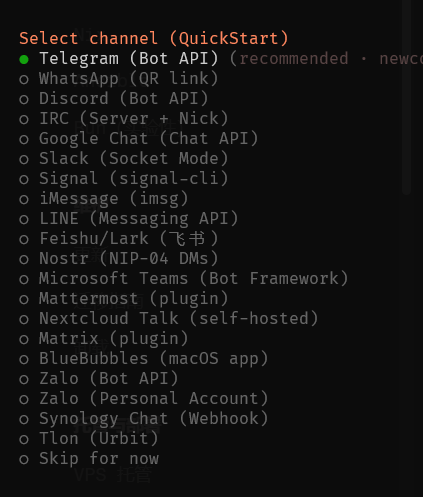

10、后续步骤Skip，选择No就好了

11、Enable hooks（全选就好了）

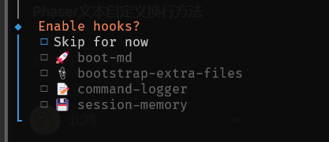

- **boot-md**：写文档用
- **bootstrap-extra-files**：管理配置文件
- **command-logger**：记录终端命令
- **session-memory**：保存工作状态

12、后续直接按Enter回车就好了

13、安装后的检查与启动

- 快速检查：`openclaw doctor`

- 检查 Gateway 网关健康状态：`openclaw status` + `openclaw health`

- 打开仪表板：`openclaw dashboard` 可以看到url，复制粘贴到游览器就可以在游览器对话了

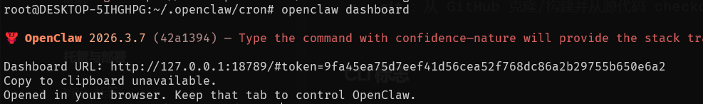

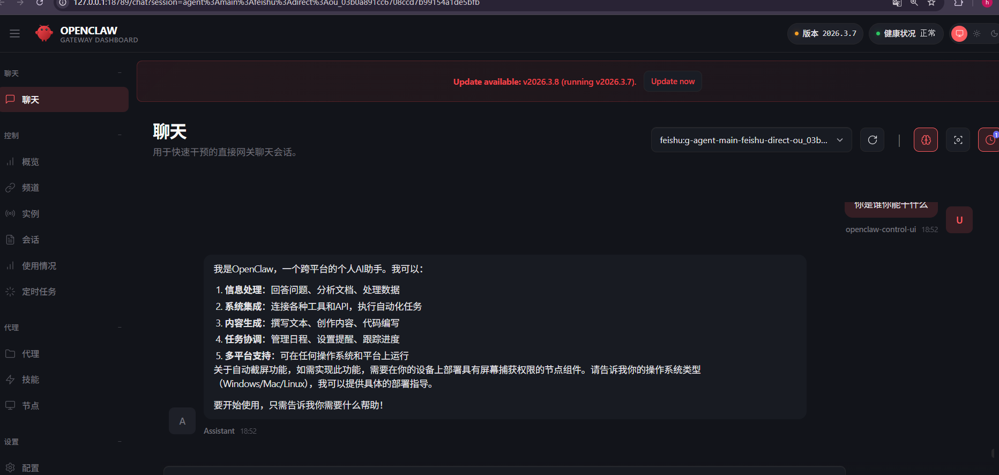

